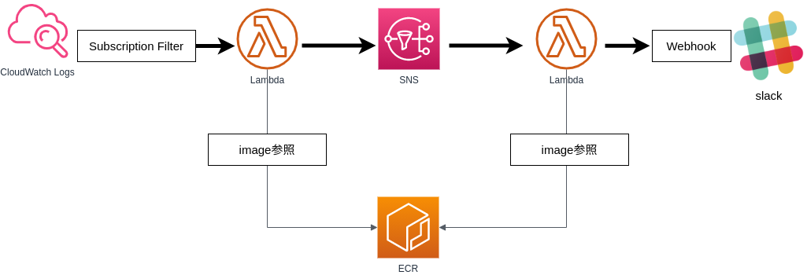

# aws_alert_sample
CloudWatch Logs の特定のロググループに特定の文字列が書き込まれたときに、Slack に通知を行うためのサンプル

構成イメージ




## 概要

### リポジトリ構成

- [repository root]
    - .github
        - workflows
            - deploy.yml
    - cfn ... AWS CloudFormation 向けテンプレート保存場所
        - alert.yml ... メインのスタックのテンプレート
        - ecr.yml ... 本アプリの CI/CD のために必要な ECR 作成のためのスタックテンプレート
    - lambda ... AWS lambda 向けの docker context
        - publish-to-sns ... publish-to-sns (構成イメージを参照のこと) のための docker context
        - send-to-slack ... send-to-slack (構成イメージを参照のこと) のための docker context

### 機能

下記の目的を実現します。
- CloudWatch Logs の特定のロググループに特定の文字列が書き込まれたときに、Slack に通知を行う

主な特徴は下記の通りです。
- AWS リソースの作成は AWS CloudFormation を使って行います
- Github Actions を使用して、変更は自動的に AWS 上に適用されます

ただし、AWS 内に必要な ECR リポジトリが作成されていることを前提としているため、cfn/ecr.yml のみは、手動で AWS 上に反映する必要がある点に注意してください。


## 使い方

使用する際には、下記の手順を順番に実行してください。


### 手順1. ECR リポジトリの作成

テンプレート cfn/ecr.yml を使用して、AWS CloudFormation にて新規スタックを作成してください。
スタック名は任意ですが、後続の手順に必要となるためメモをしておいてください。


### 手順2. Slack 上での Webhook URL 作成

下記のページなどを参考に、Slack 上にて Webhook URL を登録してください。
https://slack.com/intl/ja-jp/help/articles/115005265063-Slack-%E3%81%A7%E3%81%AE-Incoming-Webhook-%E3%81%AE%E5%88%A9%E7%94%A8


### 手順3. Github への Secrets 登録

Github の本ソースのあるリポジトリ上に、Secrets を登録します。  
リポジトリの Settings から下記の Secrets を登録してください。

- AWS_ACCESS_KEY_ID ... IAM にて発行したアクセスキー
- AWS_SECRET_ACCESS_KEY ... IAM にて発行したシークレットアクセスキー
- AWS_ECR_REPOSITORY ... ECR のリポジトリ (\<account id\>.dkr.ecr.\<region\>.amazonaws.com の形式)
- AWS_ECR_STACK_NAME ... 手順1 で作成したスタックの名前
- SLACK_WEBHOOK_URL ... 手順2 で登録した Slack の Webhook URL


### 手順4. 監視対象ログの設定

cfn/alert.yml の Resources 配下の LogsSubscriptionFilter の情報を監視対象のログのものに書き換えます。
また、監視対象のログが複数ある場合も、下記の要領でリソース定義を複数記載してください。

```yaml
  LogsSubscriptionFilter:       # <- 複数監視対象を登録する場合は、各リソースで一意な論理名になるように設定
    Type: "AWS::Logs::SubscriptionFilter"                       # <- 変更不要: 作成するリソースのタイプ
    DeletionPolicy: Delete                                      # <- 変更不要: スタック削除時の制御
    Properties:
      LogGroupName: /aws/lambda/lambda-for-test                 # <- 要変更: 監視対象のロググループ
      FilterPattern: "ERROR"                                    # <- 要変更: 監視対象のログ文言
      DestinationArn: !GetAtt PublishToSNSLambdaFunction.Arn    # <- 変更不要: 通知先の SNS
```


### 手順5. リージョンの設定

.github/workflows/deploy.yml 上の env セクションにて、対象のリージョンを設定します。

```yaml
env:
  AWS_REGION: ap-northeast-1
```


### 手順6. コミット&プッシュ

上記手順により行った変更を main ブランチへコミット＆プッシュします。
この手順を実行することで、Github Actions が実行され、AWS に必要なリソースが作成されます。


### 手順7. 確認

Github Actions が完了したら、AWS 上に関連するリソースが作成されたことを確認してください。  
もし、CloudFormation 上でエラーが出ている場合は、下記の点などを確認の上、再度 Github Actions を実行してください。
- 手順3. で登録した Secrets の値が正しいこと
- 手順3. で登録したアクセスキーのユーザーに十分な権限が与えられていること
- 手順4. で記載したリソースの定義が正しいこと
